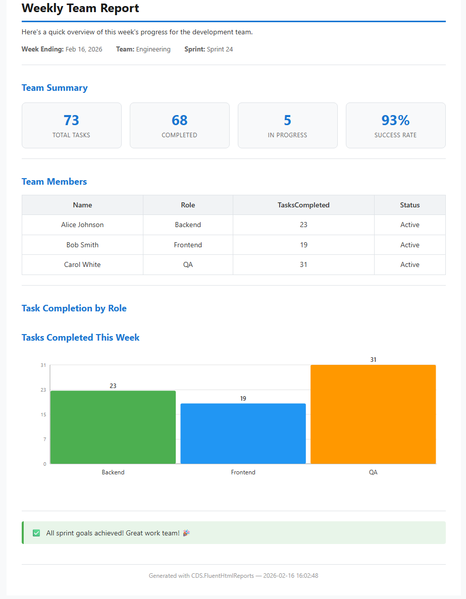

# CDS.FluentHtmlReports

A zero-dependency .NET library for generating self-contained HTML reports using a fluent API. No JavaScript, no external CSS, no build tools — just clean HTML you can open in any browser, email as an attachment, or print to PDF.

[](https://www.nuget.org/packages/CDS.FluentHtmlReports)
[](https://github.com/nooogle/CDS.FluentHtmlReports/actions/workflows/ci.yml)
[](https://github.com/nooogle/CDS.FluentHtmlReports/actions/workflows/codeql.yml)
[](https://codecov.io/gh/nooogle/CDS.FluentHtmlReports)
[](LICENSE.txt)

## Why?

Sometimes you need to produce a professional-looking report from C# without pulling in a heavyweight reporting framework, a headless browser, or a JavaScript bundler. **CDS.FluentHtmlReports** generates a single `.html` file that:

- ✅ Opens instantly in any browser
- ✅ Emails as a self-contained attachment
- ✅ Prints cleanly to PDF (Ctrl+P)
- ✅ Contains inline SVG charts — no image files
- ✅ Requires zero external dependencies

## Installation

```
dotnet add package CDS.FluentHtmlReports
```

**Targets:** .NET 8 (LTS) and .NET 10+

## Quick Start

```csharp
using CDS.FluentHtmlReports;

var teamMembers = new[]
{
    new { Name = "Alice Johnson", Role = "Backend", TasksCompleted = 23, Status = "Active" },
    new { Name = "Bob Smith",     Role = "Frontend", TasksCompleted = 19, Status = "Active" },
    new { Name = "Carol White",   Role = "QA",       TasksCompleted = 31, Status = "Active" }
};

string html = Generator
    .Create("Weekly Team Report")

    .AddParagraph("Here's a quick overview of this week's progress for the development team.")

    .AddLabelValueRow([
        ("Week Ending", DateTime.Now.ToString("MMM dd, yyyy")),
        ("Team", "Engineering"),
        ("Sprint", "Sprint 24")
    ])

    .AddLine()

    .AddHeading("Team Summary")
    .AddKpiCards([
        ("Total Tasks", "73"),
        ("Completed", "68"),
        ("In Progress", "5"),
        ("Success Rate", "93%")
    ])

    .AddLine()

    .AddHeading("Team Members")
    .AddTable(TableFixedHeader.Header, teamMembers)

    .AddLine()

    .AddHeading("Task Completion by Role")
    .AddVerticalBarChart("Tasks Completed This Week", [
        ("Backend", 23),
        ("Frontend", 19),
        ("QA", 31)
    ])

    .AddLine()

    .AddAlert(AlertLevel.Success, "All sprint goals achieved! Great work team! 🎉")

    .AddFooter("Generated with CDS.FluentHtmlReports — {timestamp}")
    .Generate();

File.WriteAllText("report.html", html);
```

That's it — one fluent chain produces a complete, styled HTML document.

### What It Looks Like

The code above generates a professional HTML report. Here's a preview of the output:




---

**The actual HTML includes:**
- ✨ Professional styling with a clean, modern design
- 📊 Inline SVG charts (bar, pie, donut, line) — no external images
- 📱 Responsive layout that works on any screen size
- 🖨️ Print-friendly formatting for PDF export
- 🎨 Color-coded alerts, progress bars, and KPI cards
- 📦 Single self-contained file — no external dependencies


---

### Demo Reports Produced by `ConsoleTest`

- [Quick Start](docs/html_demo_reports/00-quick-start.html)
- [Text Features](docs/html_demo_reports/01-text-features.html)
- [Table Features](docs/html_demo_reports/02-table-features.html)
- [Chart Features](docs/html_demo_reports/03-chart-features.html)
- [Layout Features](docs/html_demo_reports/04-layout-features.html)
- [All Features](docs/html_demo_reports/05-all-features.html)


## Features

### Text & Content

| Method | Description |
|---|---|
| `AddHeading(title, level)` | Headings H1–H6 (defaults to H2) |
| `AddParagraph(text)` | Paragraph block |
| `AddMetadata(label, value)` | Bold label / value line |
| `AddLabelValueRow(pairs)` | Inline label/value pairs on one row |
| `AddUnorderedList(items)` | Bullet list |
| `AddOrderedList(items)` | Numbered list |
| `AddAlert(level, message)` | Styled callout box (Info, Success, Warning, Error) |
| `AddCodeBlock(code, language)` | Preformatted code block |
| `AddBadge(text, color)` | Small colored label |
| `AddLink(text, url)` | Hyperlink |
| `AddDefinitionList(items)` | Term/definition pairs |
| `AddProgressBar(label, value)` | Auto-colored progress bar |
| `AddKpiCards(cards)` | Row of summary metric cards |
| `AddLine(lineType)` | Separator line (Solid, Dashed, Dotted, Blank) |
| `AddImage(bytes, mime)` | Base64-embedded image |
| `AddImageFromFile(path)` | Image from file path |
| `AddHtml(content)` | Raw HTML insertion |
| `AddFooter(text)` | Footer with optional `{timestamp}` token |
| `AddPageBreak()` | Page break for print/PDF |

### Tables

| Method | Description |
|---|---|
| `AddTable(header, data)` | Auto-generates columns from object properties |
| `AddTable(header, data, cellFormat)` | Conditional cell coloring via callback |
| `AddTable(header, data, summaryColumns)` | Summary row (Sum, Average, Min, Max, Count) |
| `AddKeyValueTable(items)` | Simple two-column key/value table |

**Header modes:** `TableFixedHeader.None`, `.Header`, `.FirstColumn`, `.Both`

### Charts (SVG)

All charts render as inline SVG — no JavaScript, no external images.

| Method | Description |
|---|---|
| `AddVerticalBarChart(title, data)` | Vertical bars with auto or explicit colors |
| `AddHorizontalBarChart(title, data)` | Horizontal bars with auto or explicit colors |
| `AddPieChart(title, data)` | Pie chart with legend |
| `AddDonutChart(title, data)` | Donut chart with legend |
| `AddLineChart(title, data)` | Single-series line chart |
| `AddLineChart(title, series)` | Multi-series line chart |

### Layout

| Method | Description |
|---|---|
| `BeginColumns()` / `EndColumns()` | Two-column CSS flexbox layout |
| `BeginColumn()` / `EndColumn()` | Individual column within a layout |
| `BeginCollapsible(title)` / `EndCollapsible()` | HTML5 collapsible section |

### Configuration

```csharp
// Option 1: Pass an options object
.WithOptions(new ReportOptions
{
    ChartWidthPercent = 75,
    ChartHeight = 300,
    ChartAlignment = ChartAlignment.Center
})

// Option 2: Configure via lambda
.WithOptions(o => o.ChartWidthPercent = 60)
```

| Property | Default | Description |
|---|---|---|
| `ChartWidthPercent` | `100` | Chart width as percentage of container (1–100) |
| `ChartHeight` | `280` | Chart height in SVG units |
| `ChartAlignment` | `Left` | Chart alignment: Left, Center, Right |

## How It Works

1. **`Generator.Create("Title")`** — starts a new HTML document with embedded CSS
2. **Chain `.Add*()` methods** — each appends HTML to an internal `StringBuilder`
3. **`.Generate()`** — closes the document and returns the complete HTML string

The output is a single self-contained HTML file with:
- An embedded stylesheet (no external CSS)
- Inline SVG for all charts (no images or JavaScript)
- Print-friendly `@media print` rules

There are no dependencies beyond the .NET Base Class Library.

## Architecture

```
Generator              Public fluent facade — the only class consumers interact with
├── TextRenderer       Headings, paragraphs, lists, alerts, layout, etc.
├── TableRenderer      Reflection-based table generation
├── ChartRenderer      SVG chart rendering (bar, pie, donut, line)
└── HtmlHelpers        Shared HTML encoding utility
```

All renderers are `internal` — the public API surface is just `Generator`, `ReportOptions`, and a handful of enums.

## Running the Demos

The `ConsoleTest` project generates a suite of demo reports:

```
cd ConsoleTest
dotnet run
```

This creates several `.html` files in your Downloads folder and opens the index in your browser. The demos cover every feature and serve as living documentation.

## Building

```
dotnet build
```

### Packing for NuGet

```
dotnet pack -c Release
```

The `.nupkg` will be in `CDS.FluentHtmlReports/bin/Release/`.


## License

[MIT](LICENSE.txt) © 2026 Carpe Diem Systems